# Kubernetes-Argo-CD-GitOps-Hello-Time-App
A simple, containerized web application that displays the current time, deployed to a Kubernetes cluster using **Argo CD** and **GitOps** best practices.

## Project Architecture
```
Kubernetes-Argo-CD-GitOps-Hello-Time-App/
├── hello-time-app/
│   ├── .dockerignore
│   ├── Dockerfile
│   ├── hello-time-app.conf
│   └── index.html
├── k8s/
│   ├── argocd-namespace.yaml
│   ├── hello-time-app-deployment.yaml
│   └── hello-time-app-service.yaml
├── LICENSE
└── README.md
```

## Overview
This project demonstrates a DevOps workflow:
* **Containerizing** a static web app with NGINX and Docker.
* **Pushing** the image to Docker Hub.
* **Defining** Kubernetes manifest files.
* **Automating deployment** using Argo CD and GitOps principles.

You can build the Docker image yourself using the files in the `hello-time-app` directory, or use the prebuilt image from Docker Hub: `koasiamah/hello-time-app:1.0.0`

## Prerequisites
* [Docker](https://docs.docker.com/get-started/get-docker/)
* [Git](https://git-scm.com/)
* [Minikube](https://minikube.sigs.k8s.io/docs/start/). You can also use Kind or any tool that allows you to create a Kubernetes cluster. Note that the command to create the cluster may vary depending on the tool.
* [kubectl](https://kubernetes.io/docs/tasks/tools/)
* [Argo CD CLI](https://argoproj.github.io/argo-cd/cli_installation/)

## Steps to Deploy
### 1. Start Minikube Cluster
```
minikube start --nodes 3 -p hello-time-app
```

### 2. Set Up Argo CD
* Apply the Argo CD namespace:
```
kubectl apply -f k8s/argocd-namespace.yaml
```

* Install Argo CD:
```
kubectl apply -n argocd -f https://raw.githubusercontent.com/argoproj/argo-cd/stable/manifests/install.yaml
```

* Wait for all Argo CD resource types to be `Ready` and `Running`:
```
kubectl -n argocd get all
```

### 3. Expose Argo CD API
* Patch the Argo CD server service to NodePort:
```
kubectl patch svc argocd-server -n argocd -p '{"spec": {"type": "NodePort"}}'
```

* Port-forward the Argo CD server service to access the Argo CD UI:
```
kubectl port-forward svc/argocd-server -n argocd 8080:443
```

* Open http://localhost:8080 in your browser (proceed past the security warning).

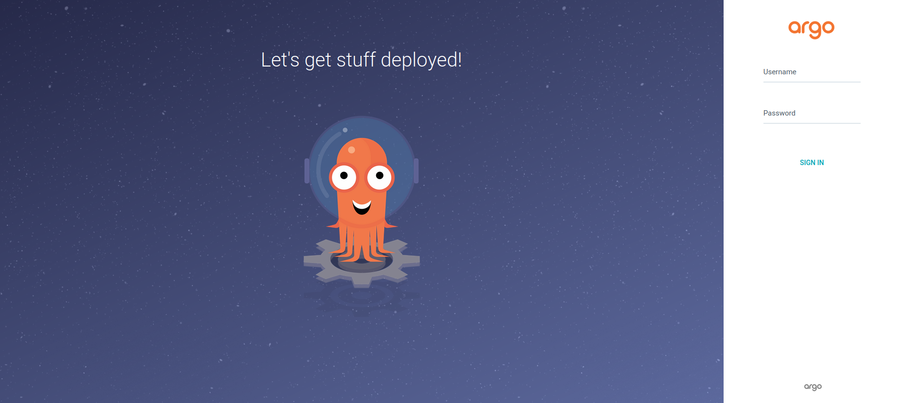

### 4. Log In to Argo CD
* Get the initial admin password:
```
kubectl -n argocd get secret argocd-initial-admin-secret -o jsonpath="{.data.password}" | base64 -d && echo
```

* Username: `admin`
* Password: (output from above command)

### 5. Connect Your GitHub Repository
* In Argo CD UI, go to **Settings > Repositories > Connect Repo**. Connect via HTTPS and enter your Repository URL: https://github.com/KwadwoAsiamah/Kubernetes-Argo-CD-GitOps-Hello-Time-App.git

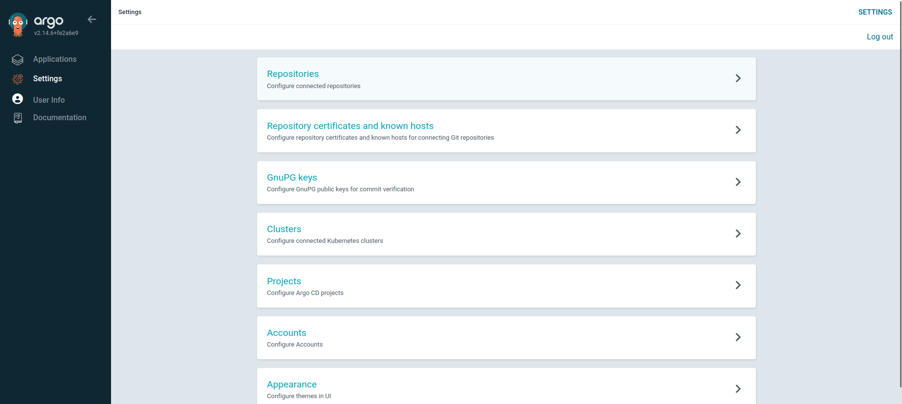

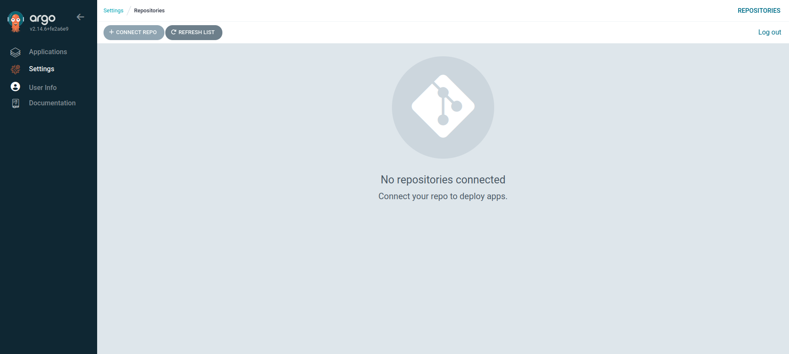

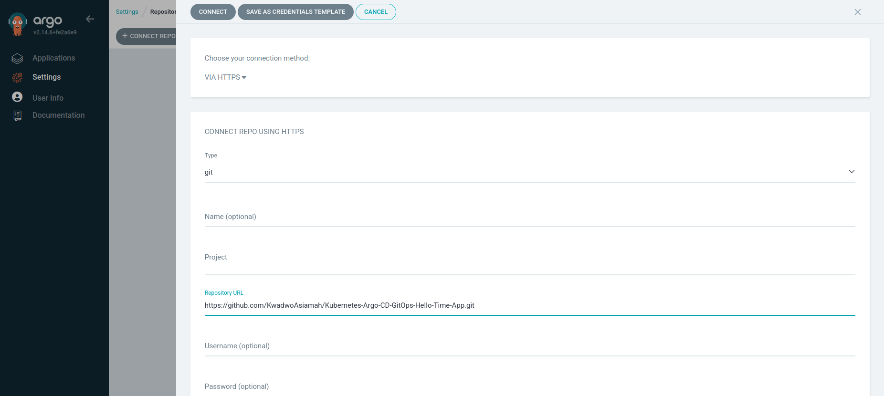

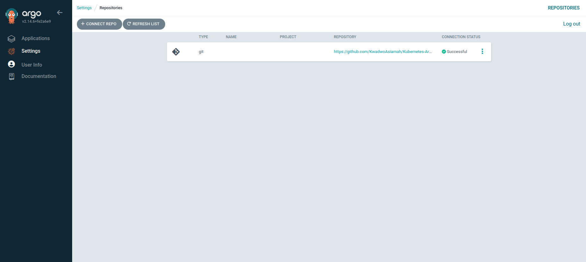

### 6. Create and Sync the Application
* In Argo CD UI, go to **Applications > New App** and fill the form:
    * **Application Name**: `hello-time-app`
    * **Project Name**: `default`
    * **Sync Policy**: `Automatic` (check `Prune Resources` and `Self Heal`). With `Prune Resources`, Argo will delete resources if they are no longer defined in Git. With `Self Heal`, Argo will force the state defined in Git into the cluster when a deviation in the cluster is detected.
    * **Repository URL**: (select your connected repo)
    * **Revision**: `HEAD`
    * **Path**: `k8s`
    * **Cluster URL**: `https://kubernetes.default.svc`
    * **Namespace**: `default`. The app will be deployed in the default namespace in your cluster.
* Click Create and wait for the app to sync and deploy.

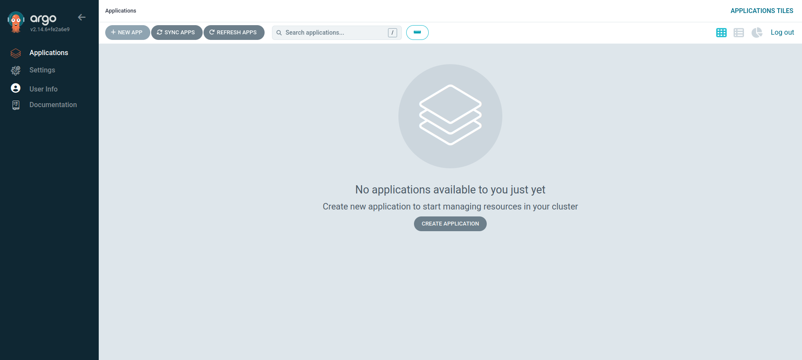

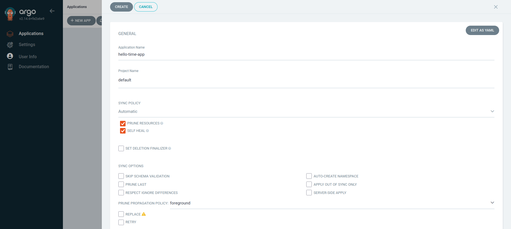

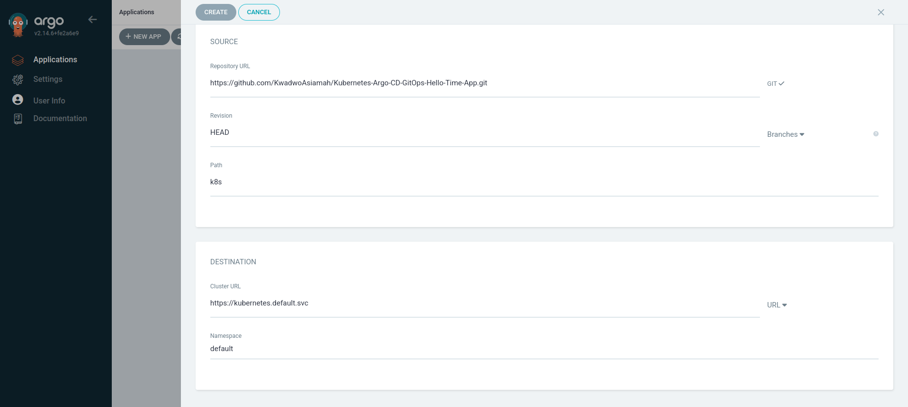

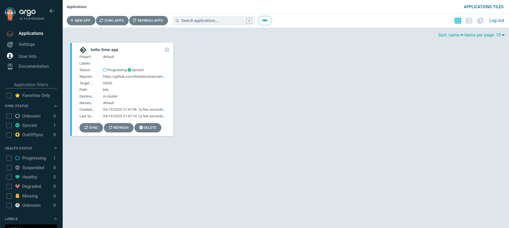

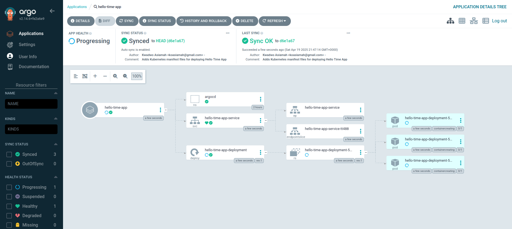

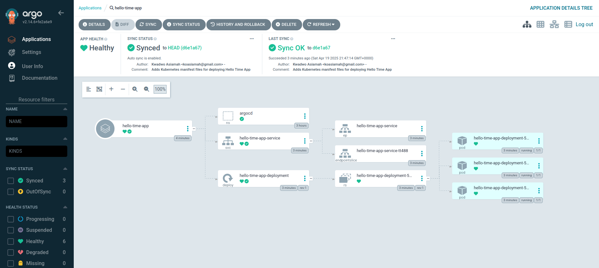

### 7. Access the Hello Time App
* In a new Terminal, port-forward the Hello Time App Service:
```
kubectl port-forward svc/hello-time-app-service -n default 8081:80
```

* Visit http://localhost:8081 to see the Hello Time App.


## Building the Docker Image (Optional)
If you want to build the image yourself:
```
cd hello-time-app
```
```
docker build -t your-docker-hub/hello-time-app:1.0.0 .
```
```
docker push your-docker-hub/hello-time-app:1.0.0
```

Update the image reference in `k8s/hello-time-app-deployment.yaml` if you use a different Docker image.
